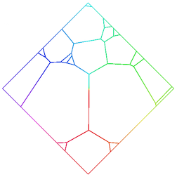
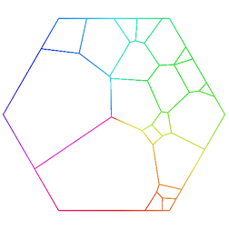
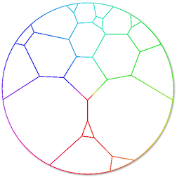

# d3-voronoi-map
This D3 plugin produces a *Voronoï map* (i.e. one-level treemap). Given a convex polygon and weighted data, it tesselates/partitions the polygon in several inner cells, such that the area of a cell represents the weight of the underlying datum.

Because a picture is worth a thousand words:






Available only for **d3 v4**.

If you're interested on multi-level treemap, which handle nested/hierarchical data, take a look at the [d3-voronoi-treemap](https://github.com/Kcnarf/d3-voronoi-treemap) plugin.

## Restrictions
* quirky way to see/display intermediate computations (as in [Voronoï playground: Voronoï map (study 2)](http://bl.ocks.org/Kcnarf/2df494f34292f24964785a25d10e69c4)); better way would be to propose a simulation (cf. [d3-force's simulation](https://github.com/d3/d3-force/blob/master/src/simulation.js))

## Context
D3 already provides a [d3-treemap](https://github.com/d3/d3-hierarchy/blob/master/README.md#treemap) module which produces a rectangular treemap. Such treemaps could be distorted to fit shapes that are not rectangles (cf. [Distorded Treemap - d3-shaped treemap](http://bl.ocks.org/Kcnarf/976b2e854965eea17a7754517043b91f)).

This plugin allows to compute a map with a unique look-and-feel, where inner areas are not strictly aligned each others, and where the outer shape can be any hole-free convex polygons (squares, rectangles, pentagon, hexagon, ... any regular convex polygon, and also any non regular hole-free convex polygon).

The drawback is that the computation of a Voronoï map is based on a iteration/looping process. Hence, it requires *some times*, depending on the number and type of data/weights, the desired representativeness of cell areas.

## Examples
* [The Individual Costs of Being Obese in the U.S. (2010)](https://bl.ocks.org/kcnarf/238fa136f763f5ad908271a170ef60e2), a remake of [HowMuch.net's post](https://howmuch.net/articles/obesity-costs-visualized)

## Installing
Load ```https://rawgit.com/Kcnarf/d3-voronoi-map/master/build/d3-voronoi-map.js``` (or its ```d3-voronoi-map.min.js``` version) to make it available in AMD, CommonJS, or vanilla environments. In vanilla, you must load the [d3-weighted-voronoi](https://github.com/Kcnarf/d3-weighted-voronoi) plugin prioir to this one, and a d3 global is exported:
```html
<script src="https://d3js.org/d3.v4.min.js"></script>
<script src="https://raw.githack.com/Kcnarf/d3-weighted-voronoi/master/build/d3-weighted-voronoi.js"></script>
<script src="https://raw.githack.com/Kcnarf/d3-voronoi-map/master/build/d3-voronoi-map.js"></script>
<script>
  var voronoiMap = d3.voronoiMap();
</script>
```

## TL;DR;
In your javascript, in order to define the tessellation:
```javascript
var voronoiMap = d3.voronoiMap()
  .weight(function(d){ return weightScale(d); }         // set the weight accessor
  .clip([0,0], [0,height], [width, height], [width,0])  // set the clipping polygon

var res = voronoiMap(data);                         // compute the weighted Voronoi tessellation; returns {polygons, iterationCount, convergenceRatio}
var cells = res.polygons
  
```

Then, later in your javascript, in order to draw cells:
```javascript
d3.selectAll('path')
  .data(cells)
  .enter()
    .append('path')
      .attr('d', function(d){ return cellLiner(d)+"z"; })
      .style('fill', function(d){ return fillScale(d.site.originalObject); })
```

## Reference
* based on [Computing Voronoï Treemaps - Faster, Simpler, and Resolution-independent ](https://www.uni-konstanz.de/mmsp/pubsys/publishedFiles/NoBr12a.pdf)
* [https://github.com/ArlindNocaj/power-voronoi-diagram](https://github.com/ArlindNocaj/power-voronoi-diagram) for a Java implementation

## API
<a name="voronoiMap" href="#voronoiMap">#</a> d3.<b>voronoiMap</b>()

Creates a new voronoiMap with the default accessors and configuration values ([*weight*](#voronoiMap_weight), [*clip*](#voronoiMap_clip), [*convergenceRatio*](#voronoiMap_convergenceRatio), [*maxIterationCount*](#voronoiMap_maxIterationCount), [*minWeightRatio*](#voronoiMap_minWeightRatio), [*initialPosition*](#voronoiMap_initialPosition), and [*initialWeight*](#voronoiMap_initialWeight)).

<a name="_voronoiMap" href="#_voronoiMap">#</a> <i>voronoiMap</i>(<i>data</i>)

Computes the **Voronoï map** for the specified *data* weights.

Returns a *hash* where *hash.polygons* is a sparse array of polygons clipped to the [*clip*](#voronoiMap_clip)-ping polygon, one for each cell (each unique input point) in the diagram. Each polygon is represented as an array of points \[*x*, *y*\] where *x* and *y* are the point coordinates, a *site* field that refers to its site (ie. with x, y and weight retrieved from the original data), and a *site.originalObject* field that refers to the corresponding element in *data*. Polygons are open: they do not contain a closing point that duplicates the first point; a triangle, for example, is an array of three points. Polygons are also counterclockwise (assuming the origin ⟨0,0⟩ is in the top-left corner). Furthermore, *hash.iterationCount* is the number of iterations required to compute the resulting map, and *hash.convergenceRatio* is the final convergence ratio (ie. cell area errors / area of the [*clip*](#voronoiMap_clip)-ping polygon).

<a name="voronoiMap_weight" href="#voronoiMap_weight">#</a> <i>voronoiMap</i>.<b>weight</b>([<i>weight</i>])

If *weight*-accessor is specified, sets the *weight* accessor. If *weight* is not specified, returns the current *weight* accessor, which defaults to:

```js
function weight(d) {
  return d.weight;
}
```

<a name="voronoiMap_clip" href="#voronoiMap_clip">#</a> <i>voronoiMap</i>.<b>clip</b>([<i>clip</i>])

If *clip* is specified, sets the clipping polygon. *clip* defines a hole-free convex polygon, and is specified as an array of 2D points \[x, y\], which must be *(i)* open (no duplication of the first D2 point) and *(ii)* counterclockwise (assuming the origin ⟨0,0⟩ is in the top-left corner). If *clip* is not specified, returns the current clipping polygon, which defaults to:

```js
[[0,0], [0,1], [1,1], [1,0]]
```

<a name="voronoiMap_convergenceRatio" href="#voronoiMap_convergenceRatio">#</a> <i>voronoiMap</i>.<b>convergenceRatio</b>([<i>convergenceRatio</i>])

If *convergenceRatio* is specified, sets the convergence ratio, which stops computation when (cell area errors / ([*clip*](#voronoiMap_clip)-ping polygon area) <= *convergenceRatio*. If *convergenceRatio* is not specified, returns the current *convergenceRatio* , which defaults to:

```js
var convergenceRation = 0.01  // stops computation when cell area error <= 1% clipping polygon's area
```

The smaller the *convergenceRatio*, the more representative is the map, the longer the computation takes time. 

<a name="voronoiMap_maxIterationCount" href="#voronoiMap_maxIterationCount">#</a> <i>voronoiMap</i>.<b>maxIterationCount</b>([<i>maxIterationCount</i>])

If *maxIterationCount* is specified, sets the maximum allowed number of iterations, which stops computation when it is reached, even if the [*convergenceRatio*](#voronoiMap_convergenceRatio) is not reached. If *maxIterationCount* is not specified, returns the current *maxIterationCount* , which defaults to:

```js
var maxIterationCount = 50;
```

If you want to wait until computation stops _only_ when the [*convergenceRatio*](#voronoiMap_convergenceRatio) is reached, just set the *maxIterationCount* to a large amount. Be warned that computation may take a huge amount of time, due to flickering behaviours in later iterations.

<a name="voronoiMap_minWeightRatio" href="#voronoiMap_minWeightRatio">#</a> <i>voronoiMap</i>.<b>minWeightRatio</b>([<i>minWeightRatio</i>])

If *minWeightRatio* is specified, sets the minimum weight ratio, which allows to compute the minimum allowed weight (_= maxWeight * minWeightRatio_). If *minWeightRatio* is not specified, returns the current *minWeightRatio* , which defaults to:

```js
var minWeightRatio = 0.01;  // 1% of maxWeight
```

*minWeightRatio* allows to mitigate flickerring behaviour (caused by too small weights), and enhances user interaction by not computing near-empty cells.

<a name="voronoiMap_initialPosition" href="#voronoiMap_initialPosition">#</a> <i>voronoiMap</i>.<b>initialPosition</b>([<i>initialPosition</i>])

If *initialPosition* is specified, sets the initial coordinate accessor. The accessor is a callback wich is passed the datum, its index, the array it comes from, and the underlying [d3-weighted-voronoi](https://github.com/Kcnarf/d3-weighted-voronoi) layout (which notably computes the initial diagram). The accessor must provide an array of two numbers ```[x, y]``` inside the clipping polygon, otherwise a random initial position is used instead. If *initialPosition* is not specified, returns the current accessor, which defaults to a random position inside the clipping polygon: 

```js
function randomInitialPosition(d, i, arr, weightedVoronoi) {
  var clippingPolygon = weightedVoronoi.clip(),
      extent = weightedVoronoi.extent(),
      minX = extent[0][0], maxX = extent[1][0], minY = extent[0][1], maxY = extent[1][1],
      dx = maxX-minX, dy = maxY-minY;
  var x,y;
  
  x = minX+dx*Math.random();
  y = minY+dy*Math.random();
  while (!polygonContains(clippingPolygon, [x, y])) { 
    x = minX+dx*Math.random();
    y = minY+dy*Math.random();
  }
  return [x, y];
};
```

Above is a quite complex accessor that uses the [d3-weighted-voronoi](https://github.com/Kcnarf/d3-weighted-voronoi)'s API to ensure that sites are positioned inside the clipping polygon, but the accessor may be simpler (-:

```js
function precomputedInitialPosition(d, i, arr, weightedVoronoi) {
  return [d.precomputedX, d.precomputedY];
};
```

Considering the same set of data, severall Voronoï map computations lead to disctinct final arrangements, due to the default random initial position of sites. If *initialPosition* is a callback producing repeatable results, then several computations produce the same final arrangement. This is useful if you want the same arrangement for distinct page loads/reloads.

<a name="voronoiMap_initialWeight" href="#voronoiMap_initialWeight">#</a> <i>voronoiMap</i>.<b>initialWeight</b>([<i>initialWeight</i>])

If *initialWeight* is specified, sets the initial weight accessor. The accessor is a callback wich is passed the datum, its index, the array it comes from, and the underlying [d3-weighted-voronoi](https://github.com/Kcnarf/d3-weighted-voronoi) layout (which notably computes the initial diagram). The accessor must provide apositive amount. If *initialWeight* is not specified, returns the current accessor, which defaults to initialize all sites with the same amount (which depends on the clipping polygon and the number of data):

```js
function halfAverageAreaInitialWeight(d, i, arr, weightedVoronoi) {
  var siteCount = arr.length,
      totalArea = d3PolygonArea(weightedVoronoi.clip());
  
  return totalArea/siteCount/2; // half of the average area of the the clipping polygon
};
```

Above is a quite complex accessor that uses the [d3-weighted-voronoi](https://github.com/Kcnarf/d3-weighted-voronoi)'s API that the same weight for all sites, but the accessor may be simpler (-:

```js
function precomputedInitialWeight(d, i, arr, weightedVoronoi) {
  return d.precomputedWeight;
};
```

Considering a unique clipping polygon where you want to animate the same data but with slightly different weights (e.g., animated according to the time), this API combined with the [*initialPosition*](#voronoiMap_initialPosition) API allows you to maintain areas from 1 set to another:
* first, compute the Voronoï map of a first set of data
* then, compute the Voronoï map of another set of data, with initial positions and initial weights set to the final values of first Voronoï map

## Dependencies
 * d3-polygon.{polygonCentroid, polygonArea, polygonContains}
 * d3-weighted-voronoi.weightedVoronoi

## Testing
In order to test the code

```sh
git clone https://github.com/Kcnarf/d3-voronoi-map.git
[...]
yarn install
[...]
yarn test
```

